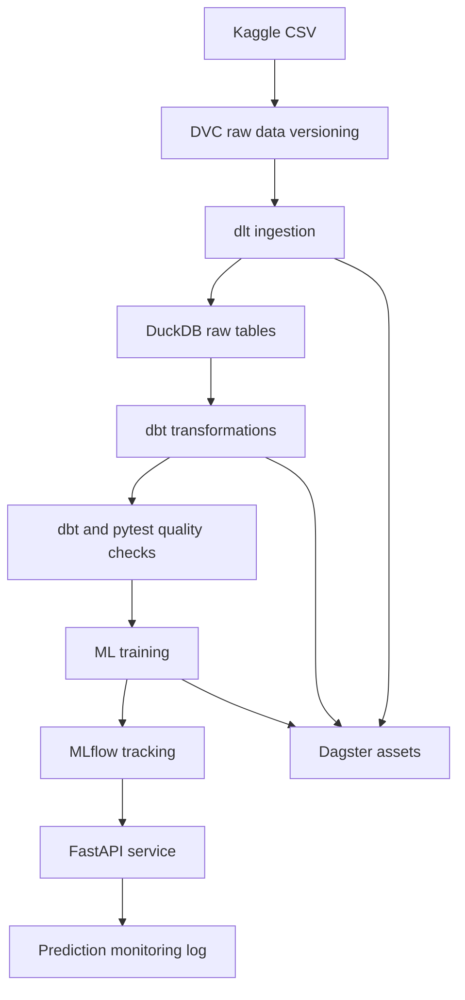

# EduScore MLOps

EduScore is an end-to-end MLOps and DataOps project that predicts a student's final score from academic behavior signals. The project demonstrates data ingestion, local warehousing, transformation, validation, model training, experiment tracking, API serving, monitoring, orchestration, Docker packaging, CI, and DVC-based data versioning.

Dataset: [Student Performance Dataset on Kaggle](https://www.kaggle.com/datasets/nabeelqureshitiii/student-performance-dataset)

## What The Project Predicts

Input features:

- `study_hours`
- `attendance_percentage`
- `class_participation`

Outputs:

- `total_score`: predicted numeric score from 0 to 100
- `grade`: derived A/B/C/D/F label

## Architecture



## Repository Map

| Path | Purpose |
| --- | --- |
| `api/` | FastAPI application and prediction endpoint |
| `data/raw/student_performance.csv.dvc` | DVC pointer for the raw CSV |
| `dbt/student_score/` | dbt project for DuckDB transformations and tests |
| `dlt_pipeline/load_student_data.py` | dlt ingestion into DuckDB |
| `docs/` | project vision, agile notes, and data contract |
| `monitoring/` | prediction log schema; generated logs are ignored |
| `pipelines/dagster_pipeline.py` | Dagster asset graph for the pipeline |
| `scripts/` | Windows helpers for Dagster and DVC |
| `src/student_score_mlops/` | config, data utilities, training, prediction, monitoring |
| `tests/` | pytest suite |
| `.github/workflows/ci.yml` | GitHub Actions lint/test/Docker build workflow |
| `.github/workflows/dataops-mlops.yml` | automated DVC, dlt, dbt, test, and training workflow |

## Prerequisites

- Python 3.12
- Git
- Docker Desktop, only if you want to build/run containers
- Google account with access to the project's DVC Google Drive folder
- On Windows, PowerShell or Command Prompt

The Python dependencies are pinned in `requirements.txt`, including `dvc-gdrive` for Google Drive remotes.

## First-Time Setup

Clone the repository and enter it:

```bash
git clone <repo-url>
cd eduscore-mlops
```

Create and activate a virtual environment.

Windows PowerShell:

```powershell
python -m venv .venv
.\.venv\Scripts\Activate.ps1
python -m pip install --upgrade pip
pip install -r requirements.txt
```

macOS/Linux:

```bash
python -m venv .venv
source .venv/bin/activate
python -m pip install --upgrade pip
pip install -r requirements.txt
```

Optional: inspect the example environment file if you want to override paths. The Python code reads environment variables from the shell; it does not automatically load `.env`.

```bash
cat .env.example
```

Windows:

```powershell
Get-Content .env.example
```

## Restore The Data

The raw CSV is not committed to Git. It is tracked by DVC through:

```text
data/raw/student_performance.csv.dvc
```

Restore it from the shared Google Drive DVC remote:

```bash
dvc pull
```

On Windows, prefer the project wrapper because it keeps DVC temporary/cache paths inside the workspace:

```powershell
scripts\dvc.cmd pull
```

The first `pull` opens a browser for Google authentication. If you cannot authenticate, see `scripts/download_data.md`.

Manual fallback:

1. Download the dataset from Kaggle.
2. Rename the CSV to `student_performance.csv`.
3. Put it at `data/raw/student_performance.csv`.

## Google Drive DVC Setup

The shared DVC remote is configured in `.dvc/config`. It points to a Google Drive folder using a `gdrive://...` URL.

To configure or replace the shared folder:

```powershell
scripts\setup_gdrive_remote.cmd <google-drive-folder-id>
```

To upload locally tracked data:

```powershell
scripts\dvc.cmd push
```

If Google blocks the default DVC OAuth app, create your own Google Cloud OAuth Desktop client, enable the Google Drive API, and run:

```powershell
scripts\setup_gdrive_oauth.cmd <google-drive-folder-id> <client-id> <client-secret>
scripts\dvc.cmd push
```

If Google says the app is in testing and returns `Error 403: access_denied`, add your Google account under Google Cloud Console > Google Auth Platform > Audience > Test users, then retry.

OAuth client credentials are stored in `.dvc/config.local`. That file is intentionally ignored and must not be committed.

## Run The Full Local Pipeline

Run these commands from the repository root:

```bash
python dlt_pipeline/load_student_data.py
dbt run --project-dir dbt/student_score --profiles-dir dbt/student_score
dbt test --project-dir dbt/student_score --profiles-dir dbt/student_score
python -m src.student_score_mlops.train
```

This creates generated local artifacts:

- `data/student_score.duckdb`
- `models/student_score_model.joblib`
- `models/metrics.json`
- `mlruns/`

These are ignored by Git because collaborators can reproduce them.

## Automated DataOps And MLOps Pipeline

The repository also includes an automated GitHub Actions workflow:

```text
.github/workflows/dataops-mlops.yml
```

It runs on `git push` when these paths change:

- `data/raw/*.dvc`
- `dlt_pipeline/**`
- `dbt/**`
- `src/**`
- `requirements.txt`

The automated flow is:

```text
new CSV -> dvc add -> dvc push -> git commit .dvc file -> git push -> GitHub Actions retrains model
```

The workflow pulls the dataset from Google Drive with DVC, runs dlt ingestion, runs `dbt run`, runs `dbt test`, runs `pytest`, trains the model, and uploads the trained model, metrics, and MLflow outputs as GitHub Actions artifacts.

For CI, configure a Google service account and add the base64-encoded JSON key as a GitHub repository secret:

```text
DVC_GDRIVE_SERVICE_ACCOUNT_JSON_B64
```

Share the Google Drive DVC folder with the service account email. See `docs/automation.md` for the full automation guide.

## Run With Dagster

Start Dagster:

```powershell
scripts\dagster_dev.cmd
```

Open the Dagster UI shown in the terminal and materialize the EduScore assets. The Dagster helper sets local home/cache paths so temporary Dagster and dlt folders stay out of the repository root.

## Run The API

Train the model first so `models/student_score_model.joblib` exists.

```bash
uvicorn api.main:app --host 0.0.0.0 --port 8000
```

Health check:

```bash
curl http://localhost:8000/health
```

Prediction example:

```bash
curl -X POST http://localhost:8000/predict \
  -H "Content-Type: application/json" \
  -d '{"study_hours": 12, "attendance_percentage": 88, "class_participation": 7}'
```

Main endpoints:

| Method | Endpoint | Description |
| --- | --- | --- |
| `GET` | `/health` | Service health check |
| `POST` | `/predict` | Predict final score and grade |

Each prediction is appended to `monitoring/predictions.jsonl`.

## Docker

Build and run the API:

```bash
docker compose up --build api
```

Run API and MLflow together:

```bash
docker compose up --build
```

Services:

- API: <http://localhost:8000>
- MLflow UI: <http://localhost:5000>

The API container mounts local `models/` and `monitoring/`. Run training before starting the API container, otherwise the model file will be missing.

## MLflow

Training logs model parameters, metrics, and artifacts to the local MLflow tracking directory:

```text
mlruns/
```

To inspect experiments:

```bash
mlflow ui --backend-store-uri mlruns --host 0.0.0.0 --port 5000
```

## Quality Checks

Run these before pushing:

```bash
ruff check .
pytest -q
dbt test --project-dir dbt/student_score --profiles-dir dbt/student_score
dvc status
```

Windows DVC command:

```powershell
scripts\dvc.cmd status
```

The GitHub Actions workflow currently runs:

- `ruff check .`
- `pytest -q`
- `docker build -t eduscore-mlops:ci .`

The DataOps and MLOps automation workflow runs:

- `dvc pull`
- `python dlt_pipeline/load_student_data.py`
- `dbt run --project-dir dbt/student_score --profiles-dir dbt/student_score`
- `dbt test --project-dir dbt/student_score --profiles-dir dbt/student_score`
- `pytest -q`
- `python -m src.student_score_mlops.train`

## Updating The Dataset

After replacing or editing `data/raw/student_performance.csv`:

```powershell
scripts\dvc.cmd add data\raw\student_performance.csv
scripts\dvc.cmd push
git add data/raw/student_performance.csv.dvc
git commit -m "Update student performance dataset"
git push
```

Commit the `.dvc` pointer, not the raw CSV. The GitHub Actions automation sees the changed `.dvc` metadata file, pulls the matching dataset from Google Drive, and retrains the model.

## What To Commit

Commit:

- source code, tests, docs, Docker files, dbt files, Dagster files
- `.dvc/config`
- `.dvc/.gitignore`
- `.dvcignore`
- `.dockerignore`
- `data/raw/student_performance.csv.dvc`
- helper scripts in `scripts/`

Do not commit:

- `.dvc/config.local`
- `.venv/`
- `data/raw/*.csv`
- `data/*.duckdb`
- `models/*.joblib`
- `models/*.json`
- `mlruns/`
- `monitoring/*.jsonl`
- `.dagster_home/`, `.dlt_home/`, `.dlt_data/`, cache folders

## Troubleshooting

`ModuleNotFoundError: No module named 'pkg_resources'` when importing MLflow:
Run `pip install -r requirements.txt`. The project pins `setuptools<81` because this MLflow version still imports `pkg_resources`.

Google says "This app is blocked":
Use a custom Google Cloud OAuth Desktop client and configure it with `scripts\setup_gdrive_oauth.cmd`.

Google says `Error 403: access_denied` and the app is in testing:
Add your Google account as a test user in the Google Cloud OAuth consent screen.

DVC tries to write outside the workspace on Windows:
Use `scripts\dvc.cmd` or `scripts\dvc.ps1` instead of plain `dvc`.

API fails because the model file is missing:
Run the full local pipeline or at least `python -m src.student_score_mlops.train`.

## Course Requirements Mapping

| Requirement | Implementation |
| --- | --- |
| Data Strategy | `docs/vision.md`, DVC-tracked raw dataset |
| Agile | `docs/agile.md` |
| dlt | `dlt_pipeline/load_student_data.py` |
| DuckDB | local `data/student_score.duckdb` |
| dbt | `dbt/student_score/` |
| Dagster | `pipelines/dagster_pipeline.py` |
| Data Quality | `docs/data_contract.md`, `tests/test_data_contract.py`, dbt tests |
| ML | `src/student_score_mlops/train.py` |
| MLflow | experiment tracking in training script |
| FastAPI | `api/main.py` |
| Docker | `Dockerfile`, `docker-compose.yml` |
| CI/CD | `.github/workflows/ci.yml`, `.github/workflows/dataops-mlops.yml` |
| Monitoring | `monitoring/prediction_log_schema.json`, `src/student_score_mlops/monitoring.py` |

## GitHub Readiness Checklist

Before pushing to GitHub:

1. Run `scripts\dvc.cmd push` so collaborators can restore the raw data.
2. Run `ruff check .` and `pytest -q`.
3. Run `scripts\dvc.cmd status`.
4. Add `DVC_GDRIVE_SERVICE_ACCOUNT_JSON_B64` in GitHub repository secrets before relying on automated retraining.
5. Confirm `.dvc/config.local` is ignored and not staged.
6. Stage the DVC pointer file, DVC config, README, scripts, and code changes.

If those checks pass, the project is ready to push. The raw data and generated artifacts should stay out of Git.
