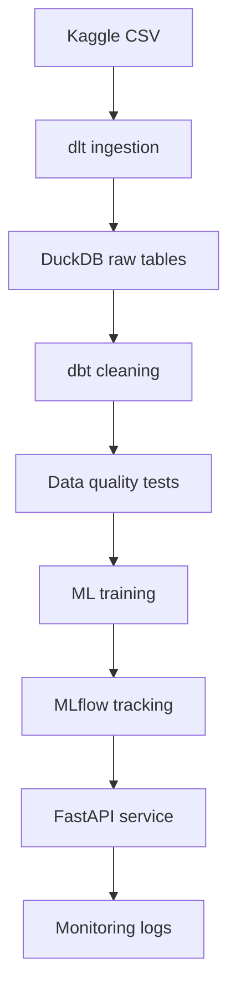

# EduScore MLOps

MLOps and DataOps project for predicting a student's final performance score from study behavior.

Dataset: [Student Performance Dataset on Kaggle](https://www.kaggle.com/datasets/nabeelqureshitiii/student-performance-dataset)

## Problem

Educational teams need an early signal that estimates a student's final score from simple academic behavior indicators:

- Average weekly self-study hours
- Attendance percentage
- Class participation

The ML service predicts:

- `total_score`: numerical score from 0 to 100
- `grade`: derived class using A/B/C/D/F thresholds

## Architecture



## Course Requirements Mapping

| Requirement | Implementation |
| --- | --- |
| Data Strategy | `docs/vision.md` |
| Agile | `docs/agile.md` |
| dlt | `dlt_pipeline/load_student_data.py` |
| DuckDB | local `data/student_score.duckdb` |
| dbt | `dbt/student_score/` |
| Dagster | `pipelines/dagster_pipeline.py` |
| Data Quality | `docs/data_contract.md`, `tests/test_data_contract.py`, dbt tests |
| ML | `src/student_score_mlops/train.py` |
| MLflow | experiment tracking in training script |
| FastAPI | `api/main.py` |
| Docker | `Dockerfile`, `docker-compose.yml` |
| CI/CD | `.github/workflows/ci.yml` |
| Monitoring | `monitoring/prediction_log_schema.json`, `src/student_score_mlops/monitoring.py` |

## Quick Start

1. Create a virtual environment.

```bash
python -m venv .venv
source .venv/bin/activate
pip install -r requirements.txt
```

2. Download the Kaggle dataset and place the CSV here:

```text
data/raw/student_performance.csv
```

3. Run the local pipeline.

```bash
python dlt_pipeline/load_student_data.py
dbt run --project-dir dbt/student_score --profiles-dir dbt/student_score
dbt test --project-dir dbt/student_score --profiles-dir dbt/student_score
python -m src.student_score_mlops.train
```

For a quick smoke test before downloading the full dataset:

```bash
RAW_DATA_PATH=data/sample/student_performance_sample.csv python -m src.student_score_mlops.train
```

4. Start the API.

```bash
uvicorn api.main:app --host 0.0.0.0 --port 8000
```

5. Test prediction.

```bash
curl -X POST http://localhost:8000/predict \
  -H "Content-Type: application/json" \
  -d '{"study_hours": 12, "attendance_percentage": 88, "class_participation": 7}'
```

## Main Endpoints

| Method | Endpoint | Description |
| --- | --- | --- |
| `GET` | `/health` | Service health check |
| `POST` | `/predict` | Predict final score and grade |

## Model

Default model: `RandomForestRegressor`

Metrics:

- MAE
- RMSE
- R2

MLflow logs parameters, metrics, and the trained model artifact.

## Notes

The dataset is simple, so the value of this project is not only the model accuracy. The real objective is to demonstrate an industrial lifecycle: ingestion, validation, transformation, training, tracking, deployment, monitoring, and CI/CD.
