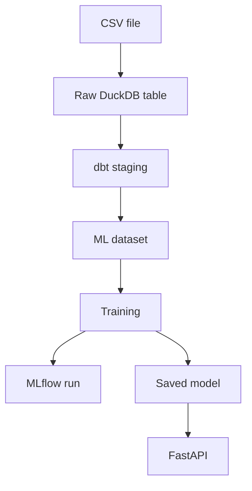
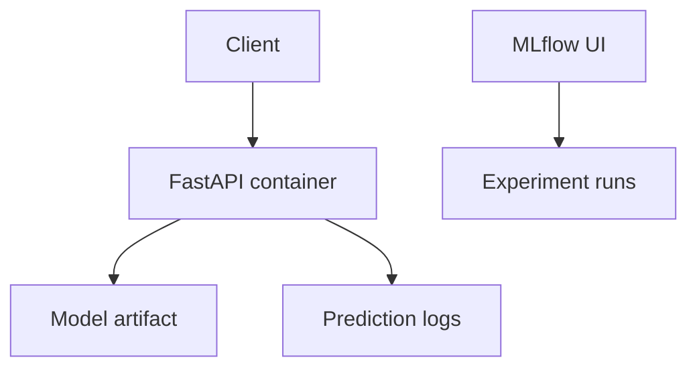

# Architecture

## Components

| Component | Tool | Role |
| --- | --- | --- |
| Source | Kaggle CSV | Raw student performance records |
| Ingestion | dlt | Reads CSV and loads DuckDB |
| Storage | DuckDB | Local analytical database |
| Transformation | dbt | Cleans names, types, and quality rules |
| Orchestration | Dagster | Runs ingestion, transformation, training |
| Experiment Tracking | MLflow | Tracks parameters, metrics, and artifacts |
| Model | scikit-learn | Predicts final score |
| Serving | FastAPI | Exposes `/predict` and `/health` |
| Containerization | Docker | Reproducible deployment |
| CI/CD | GitHub Actions | Tests, linting, Docker build |
| Monitoring | JSONL logs | Request, latency, prediction, drift input |

## Data Flow

## Deployment View

